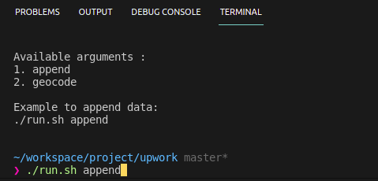

# CSV with Geocoding

## how to use

- place your source at sources folder
- run the script > `run.sh`
- you have to run the append function first, the geocode function then

## example

## result

see your result in file `result.csv`
